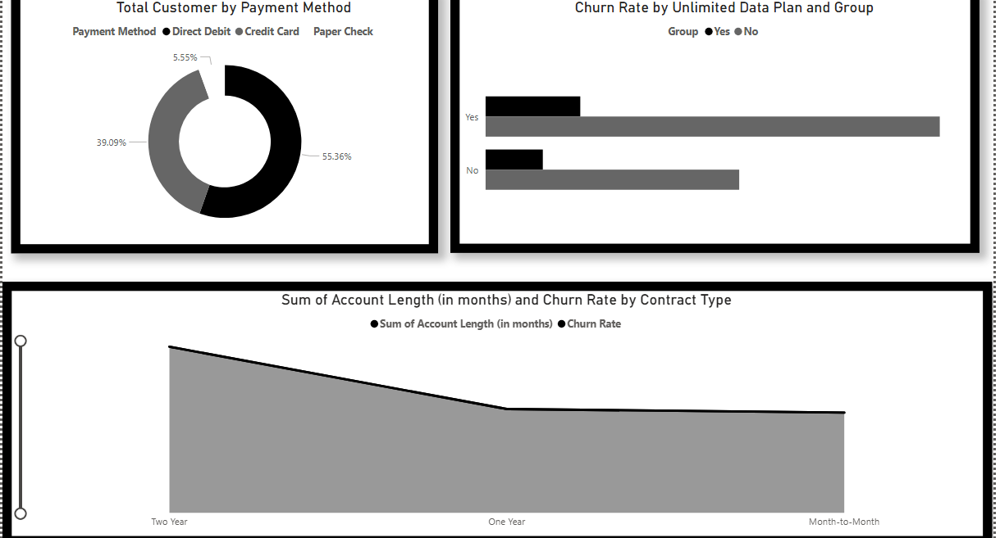

# PowerBI-Final-Project

**Power BI analysis of customer churn for Databel Telecom.**  
This project analyzes **6,687 customer records** to identify the key drivers behind a **26.86% churn rate**.  
It features **4 interactive dashboards** that explore customer demographics, contracts, and usage behavior using **custom DAX** and a structured data model.

---

# 📊 Omar Yasser — Power BI Analytics Suite

> An interactive, multi-page business intelligence dashboard built in Power BI to transform raw data into strategic insight.

---

## 🧠 Project Vision

This project is a fully interactive **Power BI analytics system** designed to:

- Reveal hidden patterns  
- Support data-driven decisions  
- Provide fast, visual understanding of complex datasets  

The dashboard is built as a **multi-page analytical experience**, not a single static report.

---

## 🖼 Dashboard Preview

  
  
  
  

---

## 🏗 Project Architecture

| Page             | Visuals | Purpose                              |
|------------------|---------|--------------------------------------|
| **Overview**     | 4       | High-level KPIs and summary insights |
| **Demographics** | 4       | Population & user breakdowns         |
| **Page 3**       | 2       | Deep-dive analytical insights        |
| **Page 4**       | 3       | Supporting metrics & comparisons     |

Each page uses Power BI’s interactive engine with cross-filtering and slicers.

---

## 🔍 Key Features

- 📈 Multi-page analytical dashboards  
- 🧩 Cross-filtering & slicers  
- 📊 Interactive visuals  
- 🗂 Structured data model  
- ⚡ Optimized for insight discovery  

---

## 🛠 Technology Stack

- **Microsoft Power BI**
- Power BI Desktop
- DAX Measures
- Data Modeling & Relationships
- Interactive Visual Framework

---

Contains:
- Data model
- Visual layouts
- Relationships
- Interactive logic

---

## 🚀 How to Use

1. Download the `.pbix` file from this repository.
2. Open it in **Power BI Desktop**.
3. Navigate using the page tabs.
4. Click, filter, and explore the data.

---

## 📌 Future Improvements

- Drill-through pages  
- Real-time data integration  
- Predictive DAX measures  
- Publish as Power BI Service app  

---

## 👤 Author

**Omar Yasser**  
Power BI • Data Analytics • Business Intelligence

---

⭐ If you like this project, give it a star and feel free to fork and build on it.

